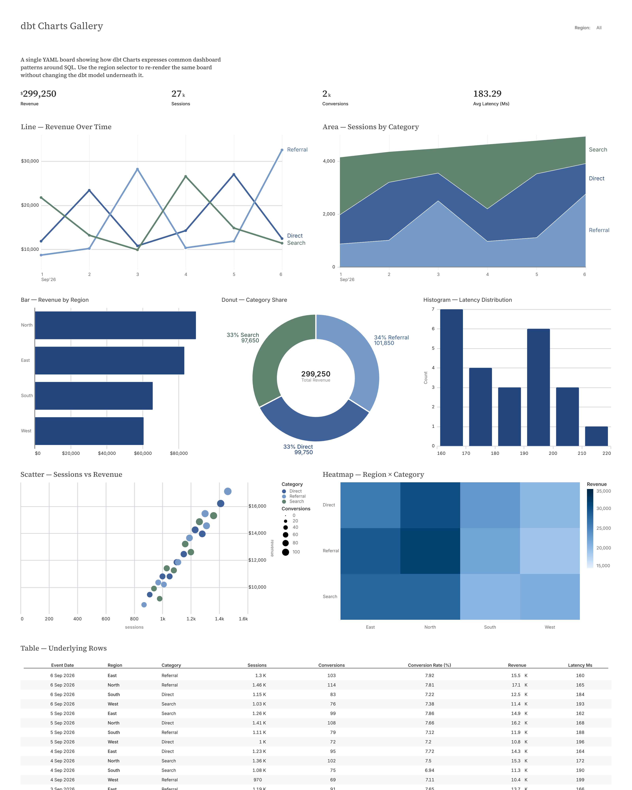

# dbt Charts Lab

A small, focused playground for exploring **dbt Charts** as dashboards-as-code.

The image below is generated from the actual `charts/chart_gallery.yml` board by CI. It is not a mockup or a separately designed marketing image.



[View the full rendered gallery](assets/chart_gallery.png)

This repo is intentionally about the charting layer itself:

- declarative dashboard YAML
- SQL-backed charts
- dbt `ref()` integration
- interactive filters
- multiple chart types and layouts
- local self-hosting with `dct serve`
- CI validation with dbt + DuckDB + dbt Charts
- HTML and PNG rendering as build outputs

The sample dataset is deliberately simple so the charts remain the main subject.

## What is included

`charts/chart_gallery.yml` demonstrates a compact gallery of common dashboard patterns:

- KPI cards
- line chart
- area chart
- bar chart
- donut chart
- scatter plot
- heatmap
- histogram
- detail table
- interactive filtering

The data path is:

```text
CSV seed
  -> dbt
  -> DuckDB
  -> dbt manifest
  -> dbt Charts
  -> live dashboard / HTML / PNG
```

## Versions

The demo is pinned to:

- dbt Charts `0.7.1`
- dbt Core `1.11.8`
- dbt DuckDB `1.10.0`
- Python `3.12`

## Run locally

```bash
python -m venv .venv
source .venv/bin/activate

python -m pip install --upgrade pip
python -m pip install \
  'dbt-charts==0.7.1' \
  'dbt-core==1.11.8' \
  'dbt-duckdb==1.10.0'

dbt build --profiles-dir .
dbt parse --profiles-dir .

dct validate charts --project-dir .
dct validate charts --warehouse --project-dir .
```

## Serve the dashboard

```bash
dct serve --host 0.0.0.0 --port 19415 --project-dir .
```

Then open the local server and browse `charts/chart_gallery.yml`.

## Render the board

HTML:

```bash
mkdir -p renders

dct render charts/chart_gallery.yml \
  --format html \
  --output renders/chart_gallery.html \
  --project-dir .
```

PNG:

```bash
mkdir -p assets

dct render charts/chart_gallery.yml \
  --format png \
  --output assets/chart_gallery.png \
  --project-dir .
```

CI also creates `assets/social_preview.png`, a 4:5 crop from the real full-board PNG for sharing on social media.

## CI

GitHub Actions verifies the full path on every change:

1. build the dbt project
2. run dbt tests
3. generate the dbt manifest
4. validate dbt Charts structure and references
5. validate compiled queries against DuckDB
6. render the dashboard to HTML and PNG
7. generate the social preview from the rendered PNG
8. deliberately break a dbt `ref()` and confirm CI catches it
9. publish the rendered images back to `assets/` on `main`
10. upload the HTML and images as a workflow artifact

## Why this repo exists

I wanted a minimal way to answer a simple question:

> Can dashboards live next to dbt models as reviewable, testable code without introducing a separate BI configuration layer for every experiment?

This repo is the working notebook for that question.

---

**dbt Charts is currently beta / pre-1.0.** The YAML surface may still evolve, so this repo pins the version used by CI.
